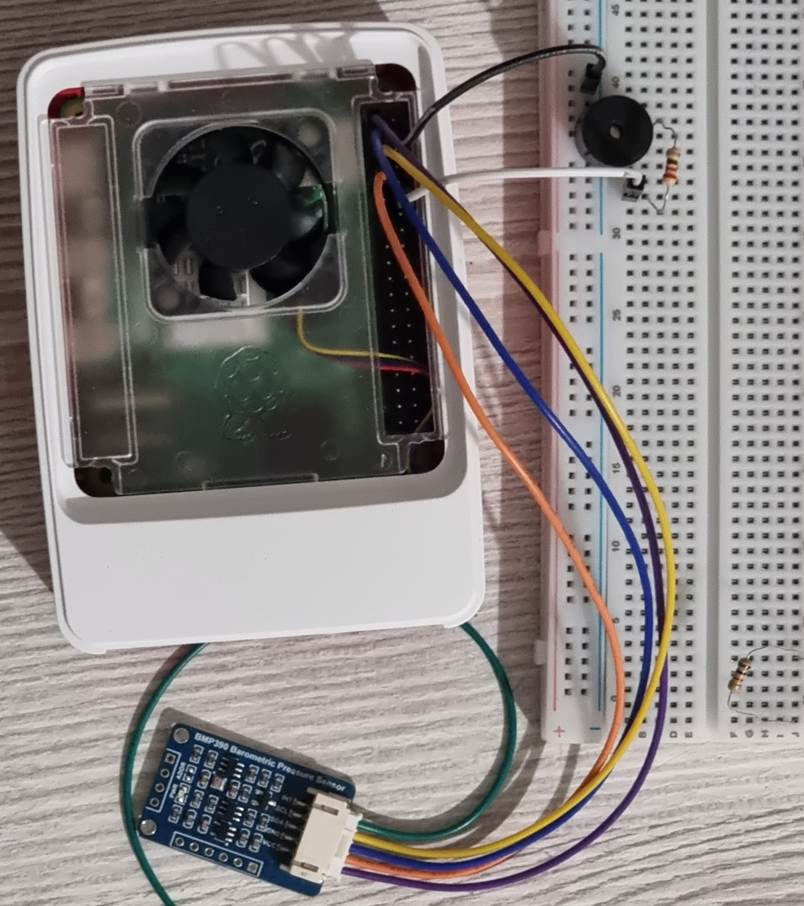
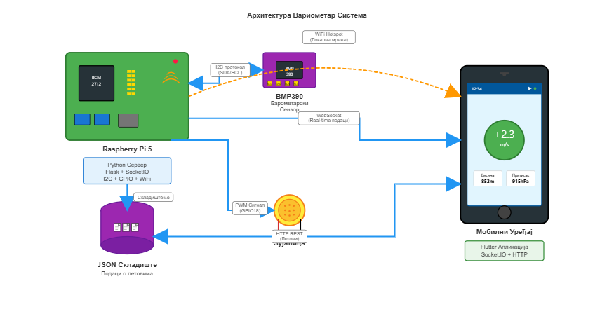
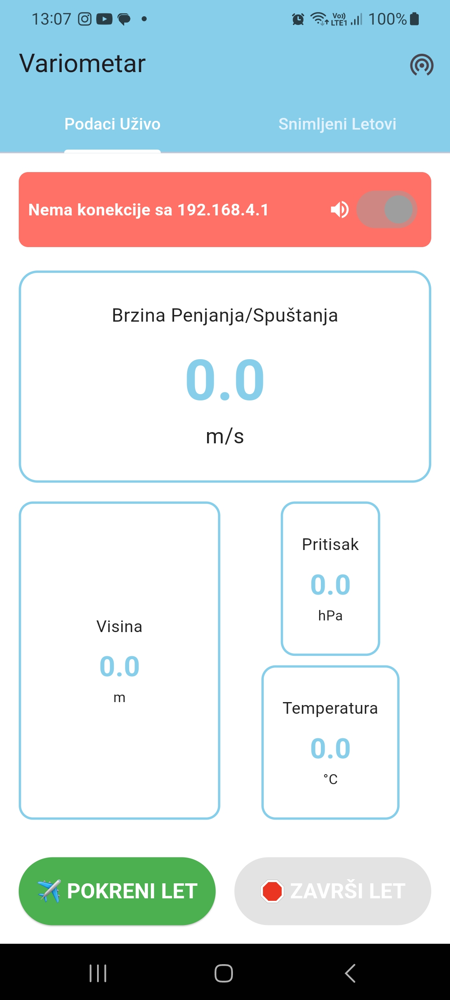
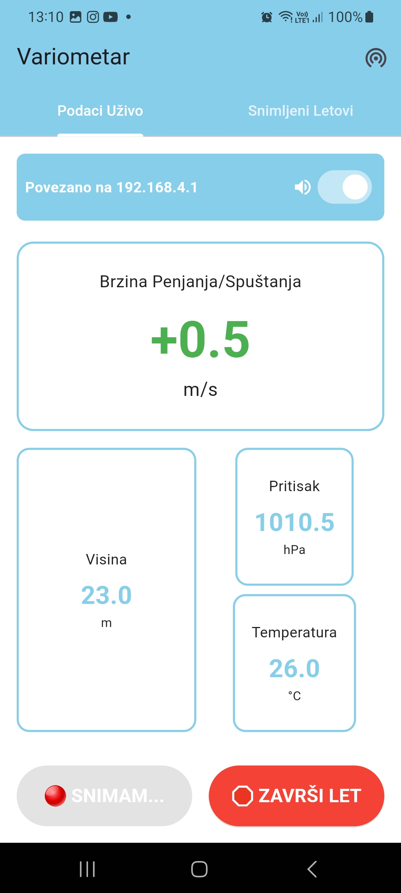
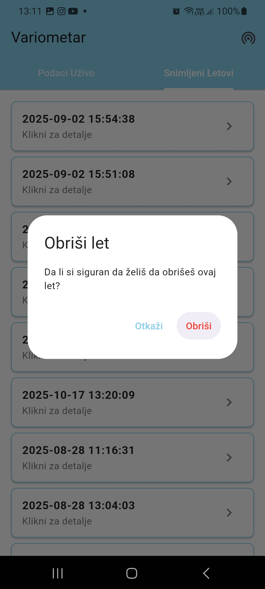

# IoT Variometar

> Variometar za paraglajding sa IoT funkcionalnostima — razvijen na Raspberry Pi 5 sa BMP390 barometarskim senzorom. Pristup podacima o letu u realnom vremenu preko WiFi mreže putem web interfejsa ili native Flutter mobilne aplikacije.

**[Read in English → README.md](README.md)**

---



---

## Funkcionalnosti

### Backend (Raspberry Pi 5)
- Real-time čitanje barometarskog pritiska, temperature i visine
- Izračunavanje brzine penjanja/spuštanja sa filtriranjem šuma
- WiFi hotspot mod za direktan pristup bez interneta
- WebSocket komunikacija za real-time podatke
- Automatsko snimanje letova sa statistikama
- REST API za upravljanje snimljenim letovima
- JSON za čuvanje podataka

### Web Interface
- Responzivan dizajn za mobilne uređaje
- Prikaz podataka sa senzora u realnom vremenu
- Start/Stop kontrole za snimanje letova
- Lista snimljenih letova sa detaljima
- Mogućnost brisanja letova

### Flutter Mobilna Aplikacija
- Native Android/iOS aplikacija
- WebSocket konekcija za real-time podatke
- Upravljanje letovima (start, stop, pregled, brisanje)
- Automatsko prebacivanje između hotspot/WiFi režima

---

## Arhitektura sistema



---

## Screenshots

| Glavni ekran | Snimanje aktivno | Detalji leta |
|:------------:|:----------------:|:------------:|
|  |  |  |

---

## Tehnička specifikacija

### Hardware
| Komponenta | Opis |
|------------|------|
| **Raspberry Pi 5** | Glavna računarska jedinica |
| **BMP390** | Barometarski senzor (±0.03 hPa) |
| **Power bank 20,000mAh** | Napajanje za portabilnost |
| **I2C komunikacija** | Konekcija senzora na GPIO pinove |

### Software Stack
| Sloj | Tehnologija |
|------|-------------|
| Backend | Python 3.11 + Flask |
| Real-time komunikacija | Flask-SocketIO (WebSocket) |
| Biblioteka senzora | Adafruit CircuitPython BMP3xx |
| WiFi hotspot | hostapd + dnsmasq |
| Mobilna aplikacija | Flutter / Dart |

### Networking
- **Hotspot mode**: RPi kreira vlastitu WiFi mrežu (`192.168.4.1`)
- **WiFi client mode**: povezivanje na postojeću mrežu
- **Hibridni pristup**: automatsko prebacivanje između režima

---

## Struktura projekta

```
variometer/
├── backend/
│   ├── variometar_web.py          # Flask web server sa WebSocket
│   ├── start_variometer.sh        # Startup script sa hotspot setup
│   └── requirements.txt           # Python dependencies
├── flutter_app/
│   ├── lib/main.dart              # Flutter aplikacija
│   └── pubspec.yaml               # Flutter dependencies
├── docs/
│   ├── images/                    # Arhitektura, proizvod, screenshots
│   └── setup_guide.md             # Detaljan setup vodič
└── README.md
```

---

## Brza instalacija

1. **Hardware**: Povezati BMP390 na RPi5 I2C pinove (vidi [setup vodič](docs/setup_guide.md))
2. **Software**: Pokrenuti setup script za dependencies i konfiguraciju
3. **Network**: Konfigurisati WiFi hotspot funkcionalnost
4. **Test**: Verifikovati komunikaciju sa senzorom i web interface na `http://192.168.4.1:5000`

Detaljan vodič → [docs/setup_guide.md](docs/setup_guide.md)

---

## Ključni algoritmi

### Filtriranje brzine penjanja
- Prosek kretanja preko 3-sekundnog prozora za smanjenje šuma senzora
- Korišćenje stvarnih timestamp-ova umesto pretpostavljenih intervala
- Stabilno čitanje tokom leta

### Statistike leta
Umesto čuvanja svih sirovih podataka, sistem čuva optimizovane statistike:
- Max/min visina i temperatura
- Max brzine penjanja/spuštanja
- Ukupno trajanje i broj merenja
- Visinska razlika tokom leta

---

## API Reference

### WebSocket Events
| Event | Smer | Opis |
|-------|------|------|
| `sensor_data` | Server → Client | Real-time podaci sa senzora |
| `start_flight` | Client → Server | Pokretanje snimanja leta |
| `stop_flight` | Client → Server | Završetak snimanja leta |

### REST API
| Metoda | Endpoint | Opis |
|--------|----------|------|
| `GET` | `/api/flights` | Lista svih letova |
| `GET` | `/api/flight/<filename>` | Detalji određenog leta |
| `DELETE` | `/api/flight/<filename>` | Brisanje leta |

---

## Performanse

| Metrika | Vrednost |
|---------|----------|
| Frekvencija čitanja | 2 Hz (svakih 0.5s) |
| Preciznost visine | ±25 cm (BMP390 specifikacija) |
| WiFi domet | 50–100 m |
| Trajanje baterije | ~6–8h (power bank 20,000mAh) |

---

## Sledeći koraci

- [ ] GPS modul za praćenje pozicije i brzine
- [ ] Cloud sync funkcionalnost
- [ ] Integrisana analiza termalnih aktivnosti

---

## O projektu

Projekat je razvijen kao diplomski rad na **Fakultetu tehničkih nauka u Novom Sadu**, smer Računarstvo i automatika. Demonstrira praktičnu primenu IoT tehnologija u oblasti sportske avijacije.
